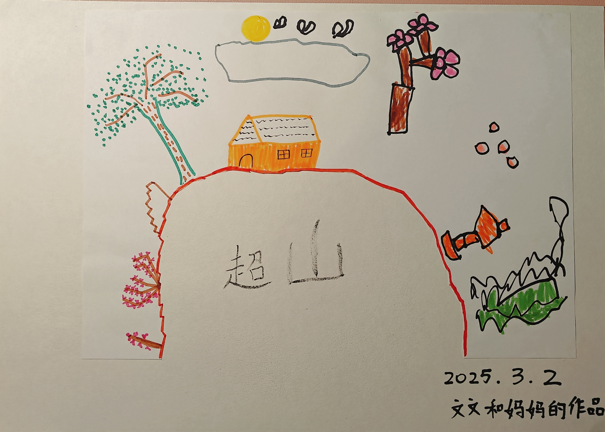

<h1 align="center">🎨 Anna's Doodles</h1>

小朋友 Anna 的简笔画作品集，记录她的创意和成长

---

## 📚 关于本项目

这里收录了 Anna 平时画的简笔画、涂鸦和小故事，每一幅画都是她想象力的延伸。  
希望这些作品能带给你微笑，也能让你看到孩子的创意之美。

---

## 🖼 作品集

### 超山

  

---

### 🌳 多多的爱心

  

---

### 节日快乐

  

---

## 📬 联系与反馈

💌 如果你喜欢 Anna 的作品，可以在 GitHub 点一个 ⭐ Star 鼓励她！  
📢 欢迎提交 Issues 分享你的想法。

---

  <i>用画笔记录成长，用想象力点亮世界</i>

